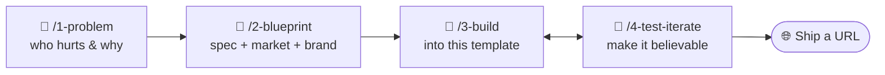

# Build It, Show It — the Rapid-Prototyping Harness 🚀

A repeatable **harness** for turning a raw idea into a clickable demo — plus a
brandable full-stack **starter kit** to build it into. Made for the *Build It,
Show It* workshop (Edmonton Unlimited · Student Founders Launch), but it works for
any founder who wants something a stranger can click *today*.

Two things live here:

1. **The harness** — four `/` skills (slash commands) that walk you from problem
   to demo. Each one **interviews you**, does the work, and saves a branded HTML
   record of your inputs and outputs.
2. **The starter kit** — a **React + Express + SQLite** app, styled with
   shadcn/ui, you build your idea into. Already a real round-trip; free to grow
   past its starting layout as your idea needs it.

**Built for Claude Code · also works in Cursor.** The harness is plain Markdown —
`.cursor/rules/harness.mdc` wires it into Cursor automatically. See
[Using with Cursor](#using-with-cursor) below.

---

## The harness flow



Run them in order in Claude Code. **Blueprint does the thinking in one mostly
auto-generated pass:** it asks at most 4 questions, then drafts the MVP, a
MoSCoW backlog, the market read, and the brand for you to correct — no more
sitting through three separate interviews before any code exists. That
blueprint becomes the single source of truth Build works against.

| Stage | Command | What it does | Saves |
| --- | --- | --- | --- |
| 1 | `/1-problem` | Name one user, one pain (the front door — creates your run folder) | `01-problem.html` |
| 2 | `/2-blueprint` | Spec, MoSCoW backlog, market read, and brand — mostly auto-drafted | `02-blueprint.html` |
| 3 | `/3-build` | Build the Musts into the template — free to go past its starting shape | `03-build.html` |
| 4 | `/4-test-iterate` | Walk the demo path, make it believable, ship it, capture learnings | `04-test-iterate.html` |

Each founder's run is saved to `workshop/runs/<your-idea>/` (gitignored — it stays
local and never overwrites anyone else's). A complete worked example for **Kora**
(an AI budgeting app for couples) lives in
[`workshop/examples/kora/`](workshop/examples/kora/) — open `workshop/index.html`
to browse it.

**No idea yet? Start from the samples.** [`workshop/inputs/`](workshop/inputs/)
ships with sample notes — `problem-statement.md`, `discovery-notes.md`, and
`seed-data.json` — so you can run `/1-problem` immediately and see the harness
work. Read them for the shape, then drop in your own.

---

## Using with Cursor

The harness was designed for **Claude Code** (slash commands, automatic
artifact-saving). If you have **Cursor** instead, `.cursor/rules/harness.mdc`
loads into every Cursor session automatically — no setup needed.

**Instead of `/1-problem`, say:** "run stage 1" or "let's do the problem stage."
Cursor reads the same SKILL.md files and follows the same interview → artifact
flow. The one difference: questions arrive as chat messages rather than
interactive pickers.

| Tool | How to start a stage | Artifact saving |
|---|---|---|
| Claude Code | `/1-problem my idea` | Automatic |
| Cursor | "run stage 1 — my idea" | Automatic (Cursor has file access) |

---

## Run the starter kit (two commands)

```bash
npm install      # installs both workspaces (web + api) + better-sqlite3
npm run dev      # starts the API and the web app together
```

| App | URL | What it does |
| --- | --- | --- |
| **Web** (React + Vite) | http://localhost:5173 | The screen you click |
| **API** (Express + SQLite) | http://localhost:3001 | `/api/items`, `/api/health` |

The template ships with **[shadcn/ui](https://ui.shadcn.com)** pre-installed — a
polished component library (Radix UI + Tailwind CSS) that makes demos look
product-quality out of the box:

`Button` · `Card` · `Input` · `Badge` · `Select` · `Skeleton` · `Separator` ·
`Label` · `Textarea` · `Tabs` · `Dialog` · `Tooltip` · `Table`

Need something else? `npx shadcn@latest add <component>` pulls in any component
from ui.shadcn.com in the same style — `/3-build` is free to do this. Browse
icons at [lucide.dev](https://lucide.dev) — `lucide-react` is also pre-installed:
`import { TrendingUp } from 'lucide-react'`.

The database (`apps/api/data/app.db`) is created and seeded automatically on first
run, so the app is never blank. Re-seed any time with `npm run seed`.

**Prerequisites:** Node.js **20.19+** (`node --version`) for Vite 8. No accounts,
no API keys. **Port 3001 busy?** Copy `.env.example` → `.env` and set
`API_PORT=3002` — both the API and the Vite proxy read it, so one line moves the
whole kit.

---

## Template shapes — three starting layouts

The starter kit ships three screen shapes as a **running start**, not a ceiling.
`/2-blueprint` picks the one closest to the founder's magic moment; `/3-build` is
free to extend, restructure, or add screens beyond it. To preview or switch any
shape locally, change `shape` in `apps/web/src/brand.js` and save — hot reload
switches instantly, no restart needed:

```js
// apps/web/src/brand.js
shape: 'search',      // ← try 'tool' or 'dashboard'
```

| Shape | `brand.shape` | Best for | Screen layout |
|---|---|---|---|
| **Search / Catalog** | `'search'` | Marketplaces, job boards, recipe finders | Search bar → card grid → detail panel |
| **Tool / Generator** | `'tool'` | AI generators, analyzers, brief builders | Form inputs → structured output |
| **Dashboard** | `'dashboard'` | SaaS metrics, spend/inventory trackers | Stat cards → filterable data table |

Each shape's files live in `apps/web/src/templates/<shape>/`. `/3-build` edits
them there — and can freely touch `src/components/ui/` or `App.jsx`'s shape
router too, if the idea has outgrown the three starting shapes.

---

## Make it yours (what `/2-blueprint` + `/3-build` automate)

1. **Brand** → `apps/web/src/brand.js` — name, tagline, logo, and one hex `primary`
   colour. That single hex drives the entire shadcn/ui colour palette at runtime.
2. **Data model** → `apps/api/src/db.js` — rename `items` and its columns (or add more).
3. **Demo data** → `apps/api/src/data/seed-items.js` — believable rows (use the
   new column names, not the template defaults).
4. **Screens** → `apps/web/src/templates/<shape>/` — update the field references
   to match the renamed columns, and add whatever components or screens the idea needs.
5. **Docs** → `apps/README.md` — kept current with an architecture diagram, the
   data model, and a short decisions log as the build evolves.

Scope to what you'll actually finish tonight — the kit is a real full-stack app,
so there's room to grow it if your idea needs more than one screen.

---

## What's inside

```
build_test_learn_workshop/
├─ package.json             # npm workspaces + `npm run dev`
├─ apps/
│  ├─ README.md             # the founder's app README (written by /3-build)
│  ├─ web/                  # React + Vite + Tailwind CSS + shadcn/ui
│  │  ├─ tailwind.config.js # Tailwind v3 config (shadcn colour tokens)
│  │  ├─ components.json    # shadcn/ui config (run `npx shadcn add <x>` to extend)
│  │  └─ src/
│  │     ├─ App.jsx         # shape router — freely restructured by /3-build
│  │     ├─ brand.js        # 🎨 name, tagline, logo, primary hex, shape (edit this!)
│  │     ├─ main.jsx        # hex→HSL conversion; sets --primary CSS var
│  │     ├─ api.js          # fetch wrapper for the API
│  │     ├─ styles.css      # Tailwind directives + shadcn CSS variable layer (incl. dark tokens)
│  │     ├─ lib/utils.js    # cn() Tailwind merge helper
│  │     ├─ templates/      # search/ · tool/ · dashboard/ — the three starting shapes
│  │     └─ components/ui/  # shadcn/ui primitives (Button, Card, Input, Badge, Dialog…)
│  └─ api/                  # Node + Express back-end
│     ├─ server.js          # routes + first-run auto-seed
│     └─ src/
│        ├─ db.js           # SQLite connection + schema (your data model)
│        ├─ items.js        # GET/POST routes (+ real-data hook)
│        └─ data/seed-items.js   # believable demo data
├─ .claude/skills/          # the harness (the 4 skills above)
└─ workshop/
   ├─ index.html            # dashboard linking the worked example + your run
   ├─ inputs/               # 📥 drop raw notes here (ships with sample inputs)
   ├─ examples/kora/        # complete 4-stage worked example
   └─ runs/<your-idea>/     # your harness output (gitignored)
```

---

## When this becomes "real"

`apps/api/src/items.js` has a **real-data hook** comment. When you outgrow the
local SQLite seed, that's the only place that changes — swap it for a real API, an
LLM (e.g. Anthropic's Claude), or a hosted database. The routes and the entire
front-end stay the same.

```bash
# turn this into your own GitHub repo
git init && git add . && git commit -m "my idea, starter build"
gh repo create my-idea --public --source=. --push
```

Stay founder-light. Build the next rung only when a real user is waiting on it.
