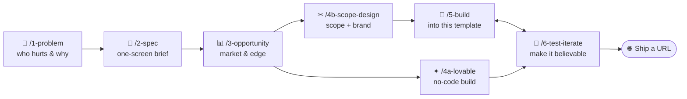

# Build It, Show It — the Rapid-Prototyping Harness 🚀

A repeatable **harness** for turning a raw idea into a clickable demo — plus a
brandable full-stack **starter kit** to build it into. Made for the *Build It,
Show It* workshop (Edmonton Unlimited · Student Founders Launch), but it works for
any founder who wants something a stranger can click *today*.

Two things live here:

1. **The harness** — seven `/` skills (slash commands) that walk you from problem
   to demo. Each one **interviews you**, does the work, and saves a branded HTML
   record of your inputs and outputs.
2. **The starter kit** — a tiny **React + Express + SQLite** app you build your
   one screen into. Already a real round-trip; you just make it *yours*.

**Built for Claude Code · also works in Cursor.** The harness is plain Markdown —
`.cursor/rules/harness.mdc` wires it into Cursor automatically. See
[Using with Cursor](#using-with-cursor) below.

---

## The harness flow



Run them in order in Claude Code. **Opportunity runs after Spec on purpose:** once
the one-screen spec exists, the market read sizes the *actual* product and feeds
the Demo Night pitch. The path forks at stage 4 — **both routes end in a clickable
demo:**

| Stage | Command | What it does | Saves |
| --- | --- | --- | --- |
| 1 | `/1-problem` | Name one user, one pain (the front door — creates your run folder) | `01-problem.html` |
| 2 | `/2-spec` | Cut it to the smallest buildable version — one screen | `02-spec.html` |
| 3 | `/3-opportunity` | Competitors, demand signals, TAM/SAM/SOM, the wedge | `03-opportunity.html` |
| 4a | `/4a-lovable` | **Route A** — 3–4 no-code prompts for Lovable | `04a-lovable.html` |
| 4b | `/4b-scope-design` | **Route B** — lock the screen + brand this starter kit | `04b-scope-design.html` |
| 5 | `/5-build` | Wire your one screen into the template (real round-trip) | `05-build.html` |
| 6 | `/6-test-iterate` | Walk the demo path, make it believable, capture learnings | `06-test-iterate.html` |

Each founder's run is saved to `workshop/runs/<your-idea>/` (gitignored — it stays
local and never overwrites anyone else's). A complete worked example for **Kora**
(an AI budgeting app for couples) lives in
[`workshop/examples/kora/`](workshop/examples/kora/) — open `workshop/index.html`
to browse it. Running it live? [`workshop/DEMO-SCRIPT.md`](workshop/DEMO-SCRIPT.md)
has paste-ready answers for every stage.

**No idea yet? Start from the samples.** [`workshop/inputs/`](workshop/inputs/)
ships with sample notes — `problem-statement.md`, `discovery-notes.md`, and
`seed-data.json` — so you can run `/1-problem` immediately and see the harness
work. Read them for the shape, then drop in your own.

---

## Using with Cursor

The harness was designed for **Claude Code** (slash commands, automatic
artifact-saving). If you have **Cursor** instead, `.cursor/rules/harness.mdc`
loads into every Cursor session automatically — no setup needed.

**Instead of `/1-problem`, say:** "run stage 1" or "let's do the problem stage."
Cursor reads the same SKILL.md files and follows the same interview → artifact
flow. The one difference: questions arrive as chat messages rather than
interactive pickers.

| Tool | How to start a stage | Artifact saving |
|---|---|---|
| Claude Code | `/1-problem my idea` | Automatic |
| Cursor | "run stage 1 — my idea" | Automatic (Cursor has file access) |

No Claude Pro? The **no-code path** (stages 1–3 + stage 4a) works with
[Lovable](https://lovable.dev) for the build step and requires no local coding
tool at all.

---

## Run the starter kit (two commands)

```bash
npm install      # installs both workspaces (web + api) + better-sqlite3
npm run dev      # starts the API and the web app together
```

| App | URL | What it does |
| --- | --- | --- |
| **Web** (React + Vite) | http://localhost:5173 | The screen you click |
| **API** (Express + SQLite) | http://localhost:3001 | `/api/items`, `/api/health` |

The template ships with **[shadcn/ui](https://ui.shadcn.com)** pre-installed — a
polished component library (Radix UI + Tailwind CSS) that makes demos look
product-quality out of the box. All core components are pre-added so founders
never need to run `npx shadcn add` during the workshop:

`Button` · `Card` · `Input` · `Badge` · `Select` · `Skeleton` · `Separator`

Browse icons at [lucide.dev](https://lucide.dev) — `lucide-react` is also
pre-installed: `import { TrendingUp } from 'lucide-react'`.

The database (`apps/api/data/app.db`) is created and seeded automatically on first
run, so the app is never blank. Re-seed any time with `npm run seed`.

**Prerequisites:** Node.js **20.19+** (`node --version`) for Vite 8. No accounts,
no API keys. **Port 3001 busy?** Copy `.env.example` → `.env` and set
`API_PORT=3002` — both the API and the Vite proxy read it, so one line moves the
whole kit.

---

## Template shapes — three screen layouts

The starter kit ships three screen shapes. `/4b-scope-design` picks the right one
based on the founder's magic moment. To preview or switch any shape locally, change
`shape` in `apps/web/src/brand.js` and save — hot reload switches instantly, no
restart needed:

```js
// apps/web/src/brand.js
shape: 'search',      // ← try 'tool' or 'dashboard'
```

| Shape | `brand.shape` | Best for | Screen layout |
|---|---|---|---|
| **Search / Catalog** | `'search'` | Marketplaces, job boards, recipe finders | Search bar → card grid → detail panel |
| **Tool / Generator** | `'tool'` | AI generators, analyzers, brief builders | Form inputs → structured output |
| **Dashboard** | `'dashboard'` | SaaS metrics, spend/inventory trackers | Stat cards → filterable data table |

Each shape's files live in `apps/web/src/templates/<shape>/`. `/5-build` edits them
there. The shared UI layer (`src/components/ui/`, shadcn/ui) is never touched.

---

## Make it yours (the 4 edits `/4b` + `/5` automate)

1. **Brand** → `apps/web/src/brand.js` — name, tagline, logo, and one hex `primary`
   colour. That single hex drives the entire shadcn/ui colour palette at runtime.
2. **Data model** → `apps/api/src/db.js` — rename `items` and its columns.
3. **Demo data** → `apps/api/src/data/seed-items.js` — believable rows (use the
   new column names, not the template defaults).
4. **Components** → `apps/web/src/components/Card.jsx`, `Detail.jsx`,
   `AddForm.jsx` — update the `item.*` field references to match the renamed columns.

Most demos are one screen — but the kit is a real full-stack app, so go bigger if
your idea needs it. Scope to what you'll actually finish.

---

## What's inside

```
build_test_learn_workshop/
├─ deck.html                # the workshop slide deck (open in a browser)
├─ package.json             # npm workspaces + `npm run dev`
├─ apps/
│  ├─ web/                  # React + Vite + Tailwind CSS + shadcn/ui
│  │  ├─ tailwind.config.js # Tailwind v3 config (shadcn colour tokens)
│  │  ├─ components.json    # shadcn/ui config (run `npx shadcn add <x>` to extend)
│  │  └─ src/
│  │     ├─ App.jsx         # THE screen: input → results → detail
│  │     ├─ brand.js        # 🎨 name, tagline, logo, primary hex (edit this!)
│  │     ├─ main.jsx        # hex→HSL conversion; sets --primary CSS var
│  │     ├─ api.js          # fetch wrapper for the API
│  │     ├─ styles.css      # Tailwind directives + shadcn CSS variable layer
│  │     ├─ lib/utils.js    # cn() Tailwind merge helper
│  │     └─ components/
│  │        ├─ Card.jsx     # result card (title · blurb · tags)
│  │        ├─ Detail.jsx   # full record view (all fields)
│  │        ├─ AddForm.jsx  # create form (proves real persistence)
│  │        └─ ui/          # shadcn/ui primitives (Button, Card, Input, Badge…)
│  └─ api/                  # Node + Express back-end
│     ├─ server.js          # routes + first-run auto-seed
│     └─ src/
│        ├─ db.js           # SQLite connection + schema (your data model)
│        ├─ items.js        # GET/POST routes (+ real-data hook)
│        └─ data/seed-items.js   # believable demo data
├─ .claude/skills/          # the harness (the 7 skills above)
└─ workshop/
   ├─ index.html            # dashboard linking the worked example + your run
   ├─ inputs/               # 📥 drop raw notes here (ships with sample inputs)
   ├─ examples/kora/        # complete 7-stage worked example
   └─ runs/<your-idea>/     # your harness output (gitignored)
```

---

## When this becomes "real"

`apps/api/src/items.js` has a **real-data hook** comment. When you outgrow the
local SQLite seed, that's the only place that changes — swap it for a real API, an
LLM (e.g. Anthropic's Claude), or a hosted database. The routes and the entire
front-end stay the same.

```bash
# turn this into your own GitHub repo
git init && git add . && git commit -m "my idea, starter build"
gh repo create my-idea --public --source=. --push
```

Stay founder-light. Build the next rung only when a real user is waiting on it.
